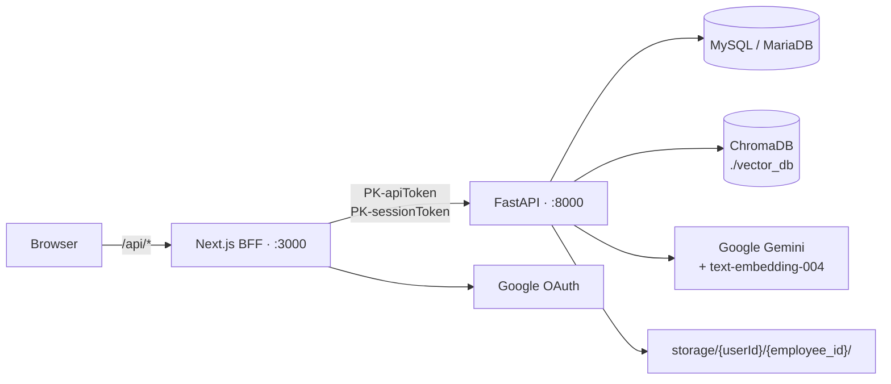

# KYC Check AI & Document RAG

An employee-KYC platform: upload identity and credential documents, extract structured fields with a
vision LLM, persist them into typed tables, and retrieve them by natural-language query using vector
search with fuzzy re-ranking.

| Application | Technology | Location |
| ----------- | ---------- | -------- |
| Backend | Python 3.11 · FastAPI · SQLAlchemy 2.x · **MySQL/MariaDB** · ChromaDB | [`backend/`](backend/) |
| Frontend | Next.js 16 (App Router) · React 19 · TypeScript | [`frontend/`](frontend/) |

---

## Contents

- [Architecture](#architecture)
- [Modules](#modules)
- [The KYC pipeline](#the-kyc-pipeline)
- [Prerequisites](#prerequisites)
- [Quick start](#quick-start)
- [Docker](#docker)
- [Environment variables](#environment-variables)
- [API overview](#api-overview)
- [Testing](#testing)
- [Documentation](#documentation)
- [Known limitations](#known-limitations)
- [Troubleshooting](#troubleshooting)

---

## Architecture

The browser calls same-origin Next.js Route Handlers, which attach `PK-apiToken` (and, for protected
calls, `PK-sessionToken` read from an httpOnly cookie) before forwarding to FastAPI.



The backend registers **no CORS middleware** — all browser traffic is same-origin, so none is needed.

Detail: [System overview](docs/architecture/system-overview.md) ·
[Backend](docs/architecture/backend-architecture.md) ·
[Frontend](docs/architecture/frontend-architecture.md) ·
[Data flow](docs/architecture/data-flow.md)

---

## Modules

The codebase contains three distinct document modules at very different maturity levels.

| Module | What it does | Status | Documentation |
| ------ | ------------ | ------ | ------------- |
| **KYC** | Employee document intake, OCR, classification, field extraction into five typed tables | ✅ **Live** — `/KYC/*` registered | [modules/kyc.md](docs/modules/kyc.md) |
| **Document RAG** | Embedding + vector retrieval over extracted KYC documents, with fuzzy re-ranking | ✅ **Live** — serves `GET /KYC/search` | [modules/document-rag.md](docs/modules/document-rag.md) |
| **Policy** | Insurance-policy extraction and Q&A over uploaded PDFs | ❌ **Not wired** — routers commented out of `main.py`, service unreferenced | [modules/policy.md](docs/modules/policy.md) |

> The navigation labels do not match the modules. The sidebar item **"KYC"** calls a `documents/*` API
> that does not exist, while the sidebar item **"Employee"** calls the working `/KYC/*` API. See
> [frontend-contract-map.md](docs/api/frontend-contract-map.md).

---

## The KYC pipeline

```
POST /KYC/upload  (files[], employee_id)
   ↓ save to storage/{userId}/{employee_id}/
   ↓ ocr_extract_text     PyMuPDF (PDF) · Gemini Vision (images) · python-docx (DOCX)
   ↓ extract_details      Gemini → classify + 18-field JSON
   ↓ persist              tbl_pan | tbl_aadhaar | tbl_resume | tbl_address_proof | tbl_qualification
   ↓ chunk + embed        models/text-embedding-004
   ↓ ChromaDB             ./vector_db

GET /KYC/search?query=...
   ↓ parse_search_query   name · document_type · aadhaar_number · pan_number
   ↓ embed query → ChromaDB search (top_k=50, metadata filter)
   ↓ rerank               1/(1+distance) + rapidfuzz.partial_ratio(name)/100
   ↓ group + build_answer
```

Documents are classified into `aadhaar_card`, `pan_card`, `resume`, `address_proof` or `qualification`.

Detail: [modules/kyc.md](docs/modules/kyc.md) · [modules/document-rag.md](docs/modules/document-rag.md)

---

## Prerequisites

| Requirement | Version | Source |
| ----------- | ------- | ------ |
| Python | **3.11** | `backend/dockerfile` (`python:3.11-slim`) |
| MySQL / MariaDB | 5.7+ / 10.x | `mysql+pymysql` driver |
| Node.js | — | **Not verified from the current implementation** — no engines field, no `.nvmrc` |
| npm | — | `package-lock.json` present |
| Google Gemini API key | — | Required — used for OCR, classification and extraction |

Full detail: [setup/prerequisites.md](docs/setup/prerequisites.md)

---

## Quick start

```bash
# 1. Database — create an empty schema; tables are created on first boot
mysql -u root -p -e "CREATE DATABASE kyc_check;"

# 2. Backend
cd backend
python -m venv venv
.\venv\Scripts\activate                    # Windows
python -m pip install --upgrade pip
pip install torch==2.9.1 torchaudio==2.9.1 --index-url https://download.pytorch.org/whl/cpu

# requirements.txt is UTF-16 — convert before installing
iconv -f UTF-16 -t UTF-8 requirements.txt > requirements.utf8.txt
pip install -r requirements.utf8.txt

# create backend/.env  (see Environment variables)
uvicorn app.main:app --reload --host 0.0.0.0 --port 8000

# 3. Frontend (new terminal)
cd frontend
npm i
# create frontend/.env.local
npm run dev
```

Open <http://localhost:3000>. The root path redirects to `/home`.

> `backend/readme` documents only four steps (venv, activate, pip upgrade, torch). The dependency
> install and run commands above come from `backend/dockerfile`. See
> [setup/backend-setup.md](docs/setup/backend-setup.md).

---

## Docker

A Dockerfile is provided for the backend:

```bash
cd backend
docker build -t kyc-check-backend .
docker run -p 8000:8000 --env-file .env kyc-check-backend
```

```dockerfile
FROM python:3.11-slim
WORKDIR /app
COPY requirements.txt .
RUN pip install --upgrade pip==25.3
RUN pip install -r requirements.txt
COPY . .
EXPOSE 8000
CMD ["uvicorn", "app.main:app", "--host", "0.0.0.0", "--port", "8000"]
```

> The image build will fail on `pip install -r requirements.txt` for the same UTF-16 reason. There is
> **no Dockerfile for the frontend and no compose file.** See [setup/docker.md](docs/setup/docker.md).

---

## Environment variables

### `backend/.env` — 20 defined, 13 read

Required: `DB_HOST`, `DB_PORT`, `DB_NAME`, `DB_USERNAME`, `DB_PASSWORD`, `API_TOKEN`, `TOKEN_SECRET`,
`GOOGLE_API_KEY`, `CHROMA_DIR`.

Optional with code defaults: `GOOGLE_AI_MODEL` (`gemini-2.0-flash`), `DEFAULT_COUNTRY` (`IN`),
`DEFAULT_TZ` (`Asia/Kolkata`).

### `frontend/.env.local`

`NEXT_PUBLIC_API_URL` (must end with `/`), `API_TOKEN`, and for Google sign-in `CLIENT_ID`,
`CLIENT_SECRET`, `REDIRECT_URI`.

Complete inventory including the 11 variables that are defined but never read:
[setup/environment-variables.md](docs/setup/environment-variables.md)

---

## API overview

All endpoints require `PK-apiToken`; protected routes additionally require `PK-sessionToken`. Every
response uses a fixed envelope returned with **HTTP 200**, including errors:

```json
{ "Success": { "message": "…", "data": {} }, "Code": 0,    "Error": null }
{ "Success": null,                           "Code": 4002, "Error": { "message": "…" } }
```

| Group | Prefix | Endpoints | Reference |
| ----- | ------ | --------: | --------- |
| User & auth | `/user` | 10 | [user-auth.md](docs/api/user-auth.md) |
| Masters | `/master` | 8 | [masters.md](docs/api/masters.md) |
| Admin | `/admin_user` | 2 | [admin.md](docs/api/admin.md) |
| Employee KYC | `/KYC` | 7 | [kyc.md](docs/api/kyc.md) |

**27 live endpoints + `GET /`.** Twelve more exist in unregistered routers.

Conventions: [overview.md](docs/api/overview.md) · Codes: [error-codes.md](docs/api/error-codes.md) ·
**Frontend↔backend mapping: [frontend-contract-map.md](docs/api/frontend-contract-map.md)**

---

## Testing

**No automated tests.** No pytest, Jest, Vitest or Playwright configuration, no `test` script, no CI
pipeline. `backend/test.db` is a 0-byte file. See [testing-status.md](docs/testing/testing-status.md).

---

## Documentation

| Area | Entry point |
| ---- | ----------- |
| Index | [docs/README.md](docs/README.md) |
| Architecture | [docs/architecture/](docs/architecture/) |
| Modules — KYC · RAG · Policy | [docs/modules/](docs/modules/) |
| Setup | [docs/setup/](docs/setup/) |
| API reference | [docs/api/](docs/api/) |
| Database schema | [docs/database/schema.md](docs/database/schema.md) |
| Security | [docs/security/authentication-and-authorization.md](docs/security/authentication-and-authorization.md) |
| Integrations | [docs/integrations/](docs/integrations/) |
| Roadmap | [docs/roadmap/upcoming-features.md](docs/roadmap/upcoming-features.md) |
| Testing | [docs/testing/testing-status.md](docs/testing/testing-status.md) |
| Troubleshooting | [docs/troubleshooting/common-issues.md](docs/troubleshooting/common-issues.md) |
| **Code audit — 26 confirmed issues** | [AUDIT.md](AUDIT.md) |

---

## Known limitations

- **Only 12 of 29 frontend API handlers reach a live backend endpoint.** Four are missing a `user/`
  prefix, five target commented-out routers, and seven have no backend at all.
  [frontend-contract-map.md](docs/api/frontend-contract-map.md)
- **`userId` is hard-coded** to `"U-98WZ41BUTTOM"` on both KYC upload and search, so all documents
  share one tenant. [AUDIT.md](AUDIT.md) issue 1.
- **Logout never reaches the backend** — the handler builds the request but never sends it, so server
  sessions are never invalidated. [AUDIT.md](AUDIT.md) issue 3.
- **Uploaded PAN, Aadhaar and resumes are served without authentication** via the `/storage` mount.
- **No route guard** — `(auth)` is a naming convention; there is no `middleware.ts`.
- **The Policy module is not wired in** — its three routers are commented out and its service is
  unreferenced and contains four defects.
- **No database migrations** for 16 models; `create_all()` never alters existing tables.
- **Errors return HTTP 200** — clients must inspect `Code`.

---

## Troubleshooting

Dependency install failures, database connection errors, empty search results, upload failures and
contract mismatches: [troubleshooting/common-issues.md](docs/troubleshooting/common-issues.md)
