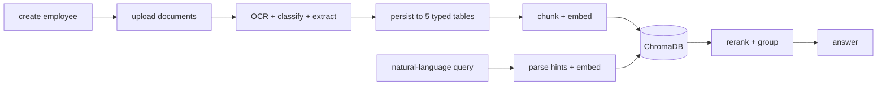

# Data Flow

End-to-end journeys, traced to source.

## The working path



---

## Flow 1 — Employee creation

```
UI: /employee/create-employee
  → POST /api/employee/create-employee
  → POST /KYC/create        EmployeeCreate { emp_name, emp_id? }
  → EmployeeController.create
  → INSERT tbl_employees    (emp_id unique + indexed, status=1)
```

---

## Flow 2 — Document ingestion

```
POST /KYC/upload   (files[], employee_id)
  │
  ├─ guard: if not files → Code 4002
  ├─ userId = "U-98WZ41BUTTOM"                      ← hard-coded, ignores session
  │
  └─ handle_upload_documents → per file: _process_single_file
       │
       ├─ save_local_file(user_id, employee_id, file)
       │     → storage/{userId}/{employee_id}/{secure_filename}
       │
       ├─ ocr_extract_text(path)
       │     ├─ .pdf   → PyMuPDF opens → pages rendered → Gemini Vision
       │     ├─ image  → base64 → Gemini Vision
       │     └─ .docx  → python-docx paragraphs (no LLM)
       │
       ├─ extract_details(text)                      Gemini, strict-JSON prompt
       │     → { document_type, name, doc_number, dob, gender, address,
       │         mobile, email, job_role, work_experience_years, last_company,
       │         skills[], highest_qualification, institute_name, specialization,
       │         year_of_passing, address_proof_type, extra }
       │     → clean_gemini_json → json.loads
       │     → on failure: stub with document_type="other" (still saved)
       │
       ├─ save_document_and_get_id(db, emp_id, details)
       │     → tbl_pan | tbl_aadhaar | tbl_resume | tbl_address_proof | tbl_qualification
       │
       └─ chunk_text(text, size=50_000)              → usually ONE chunk
             └─ per chunk:
                  gen_embedding(chunk)               models/text-embedding-004
                  build_vector_payload(userId, employee_id, record_id, details)
                  vector_db.add_vector(vector, metadata, document_details)
```

### Classification routing

| `document_type` | Destination table |
| --------------- | ----------------- |
| `pan_card` | `tbl_pan` |
| `aadhaar_card` | `tbl_aadhaar` |
| `resume` | `tbl_resume` |
| `address_proof` | `tbl_address_proof` |
| `qualification` | `tbl_qualification` |
| `other` | — extraction failed or unrecognised |

Two helpers shape resume data before insert: `_last_company(details)` and `_skills(details)`.

> **The UI cannot reach this endpoint.** `/api/employee/employee-upload` targets
> `document/upload?project_id=…`, which does not exist. [AUDIT.md](../../AUDIT.md) issue 8.

---

## Flow 3 — Retrieval

```
GET /KYC/search?query=…
  │
  ├─ request.state.userId = "U-98WZ41BUTTOM"        ← overwrites middleware value
  ├─ guard: empty/whitespace query → Code 4002
  │
  └─ handle_search_documents
       │
       ├─ parsed = parse_search_query(query)
       │     extract_name_from_query · detect_document_type
       │     detect_gender · extract_dob_from_query
       │
       ├─ where = {"userId": user_id.lower()}
       │     += document_type | aadhaar_number | pan_number | full_name (if parsed)
       │
       ├─ query_vec = gen_embedding(query)
       │
       ├─ hits = vector_db.search(query_vector=query_vec, top_k=50, where=where)
       │
       ├─ per hit:
       │     skip if "record_id" or "document_type" missing from metadata
       │     payload = json.loads(raw)
       │     score = 1/(1+distance) + fuzz.partial_ratio(name, payload.full_name)/100
       │     key = f"{doc_type}_{record_id}"        → grouped
       │
       └─ build_answer(query, dataList)
```

The hybrid score deliberately lets an exact name match roughly double a result's rank — the right
trade-off for identity lookup.

---

## Flow 4 — Authentication

```
POST /api/login  { mobile, password }
  → POST {API_URL}user/login
  → AuthService.verify_password(password, user.password)      pbkdf2_sha256
  → token = encrypt_data({...})                               Fernet, TOKEN_SECRET
  → INSERT tbl_users_sessions (userId, session_token)
  → response: Success.data { session_token, username }
  → handler sets:
       session_token  httpOnly, secure, sameSite=lax, 7 days
       username       readable

later requests:
  handler reads session_token cookie → sends PK-sessionToken
  → UserApiVerifyMiddleware checks PK-apiToken
  → Depends(verify_session) validates the session against tbl_users_sessions
```

Google OAuth substitutes steps 1–3 with an authorization-code exchange terminating at
`user/login-email`, which issues the same session token.

**Logout does not complete this loop** — the handler deletes cookies without calling the backend, so
the session row stays active. [AUDIT.md](../../AUDIT.md) issue 3.

---

## Flow 5 — Policy module (not wired in)

Documented for completeness; every step is unreachable today.

```
POST /upload            → hash file → store uploaded_pdfs/{hash}.pdf
                        → extract → uploaded_pdfs/{hash}.json
                        → store_document → Chroma "pdf_chunks" (embedding-001)

GET /query?q=…          → rag_service.answer_question
                             detect_language → translate_to_english
                             → search_vectors → top-3 context
                             → Gemini → 25-field insurance-policy JSON
                             → translate_values_only → _pdf_references
                             → create_query_entry (history)
```

The registered-but-disabled `query.py` implements something different again — it reads
`uploaded_pdfs/*.json` from disk with no vector search and no LLM. See
[../modules/policy.md](../modules/policy.md).

---

## Where data comes to rest

| Data | Location | Written by |
| ---- | -------- | ---------- |
| Employees | `tbl_employees` | `/KYC/create` |
| Extracted document fields | 5 typed tables | `/KYC/upload` |
| Source files | `storage/{userId}/{employee_id}/` | `/KYC/upload` |
| Embeddings | ChromaDB `./vector_db` | `/KYC/upload` |
| Users, admins, sessions, OTP | `tbl_users`, `tbl_admin`, `tbl_*_sessions`, `tbl_otps` | auth flows |
| Masters | `tbl_category_master`, `tbl_feature_type_master` | `/master/*/save` |
| Policy PDFs + JSON | `app/uploaded_pdfs/` | disabled module |
| Policy vectors | `app/chroma_store/` | disabled module |

`tbl_documents` and `tbl_document_vectors` exist but belong to the unregistered `documents/*` flow —
whether any live path writes to them is **not verified from the current implementation**.

## Deletion

Deletion is incomplete across the system:

- `DELETE /KYC/delete` removes the employee row.
- The five document tables have `status` and `deletedAt` columns; whether the delete cascades to them
  is **not verified from the current implementation**.
- `handle_delete_document` and the `VectorStore.delete_*` methods exist but **no route calls them**, so
  vectors persist after an employee is removed and remain searchable.
