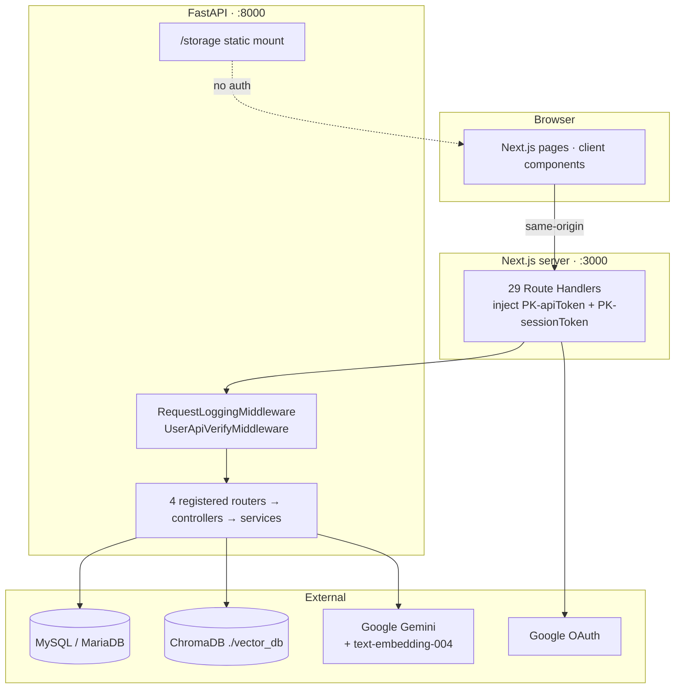

# System Overview

## What the system does

A recruiter creates an employee record, uploads whatever identity and credential documents the
candidate provided, and the system determines what each file is, extracts its fields, stores them in
typed tables, and indexes them for natural-language retrieval.

## Topology



## The BFF pattern

Pages call relative paths such as `/api/login`. Those resolve to Next.js Route Handlers running
server-side, which read `API_TOKEN` from the server environment and — for protected calls — the
`session_token` httpOnly cookie, then forward to FastAPI:

```ts
const cookieStore = await cookies();
const token = cookieStore.get("session_token")?.value;
const { data } = await axios.post(`${API_URL.replace(/\/$/, "")}/master/feature/list`, body, {
  headers: { "PK-apiToken": API_TOKEN, "PK-sessionToken": token },
});
```

Consequences:

1. **Neither secret reaches the browser.** `API_TOKEN` has no `NEXT_PUBLIC_` prefix; the session token
   lives in an `httpOnly` cookie.
2. **No CORS configuration is needed**, and none exists.
3. URL construction is inconsistent — most handlers use `API_URL.replace(/\/$/, "")`, but
   `user-list` uses `` `${API_URL}/employee/list` `` and double-slashes.

> **Only 12 of the 29 handlers reach a live endpoint.** See
> [../api/frontend-contract-map.md](../api/frontend-contract-map.md).

## Request lifecycle

```
Browser fetch("/api/...")
  ├─ Next.js Route Handler — adds PK-apiToken (+ PK-sessionToken)
  ▼
RequestLoggingMiddleware
  ▼
UserApiVerifyMiddleware
  │   ├─ path in ["/", "/docs", "/redoc", "/openapi.json"] → pass through
  │   ├─ no PK-apiToken           → Code 5001
  │   ├─ token mismatch           → Code 5002
  │   └─ sets request.state.country / timezone / dialing_code / base_url
  ▼
GlobalExceptionMiddleware
  ▼
APIRouter → Controller → Service → Model → MySQL
                                 → ChromaDB / Gemini
  ▼
success_response | error_response   →  always HTTP 200, {Success, Code, Error}
```

Protected routers add `Depends(verify_session)`, which validates `PK-sessionToken` against
`tbl_users_sessions` via `session_service`.

## Technology stack — verified

| Concern | Choice | Evidence |
| ------- | ------ | -------- |
| Runtime | Python **3.11** | `backend/dockerfile` |
| Web framework | FastAPI 0.127.0, uvicorn 0.40.0 | `requirements.txt` |
| **Database** | **MySQL / MariaDB** via `mysql+pymysql` | `connection.py:29,34` |
| ORM | SQLAlchemy 2.0.45 | `requirements.txt` |
| Vector store | **ChromaDB 1.3.7**, `PersistentClient` | `vector/vector_db.py:15` |
| Embeddings | **`models/text-embedding-004`** | `kyc_document_parser.py:37` |
| LLM | Gemini, `GOOGLE_AI_MODEL` default `gemini-2.0-flash` | `kyc_document_parser.py:26` |
| Fuzzy matching | RapidFuzz 3.14.3 | `kyc_document_service.py` |
| Documents | PyMuPDF 1.26.7, python-docx 1.2.0, Pillow 12.0.0 | `requirements.txt` |
| Passwords | passlib `pbkdf2_sha256` | `auth_service.py:22` |
| Token crypto | `cryptography` Fernet, keyed from `TOKEN_SECRET` | `utils/crypto.py` |
| Frontend | Next.js 16.0.3, React 19.2.0 | `package.json` |
| Deployment | **Dockerfile** (backend only) | `backend/dockerfile` |

## Registered surface

| Router | Prefix | Endpoints |
| ------ | ------ | --------: |
| login public | `/user` | 6 |
| login protected | `/user` | 4 |
| master public | `/master` | 4 |
| master protected | `/master` | 4 |
| admin | `/admin_user` | 2 |
| KYC public | `/KYC` | 7 |
| KYC protected | `/KYC` | 0 (declared, no routes) |

**27 + `GET /`.** Twelve further endpoints exist in unregistered routers — see
[../modules/policy.md](../modules/policy.md).

## What is deliberately absent

| Not present | Consequence |
| ----------- | ----------- |
| CORS middleware | Correct for a same-origin BFF |
| Celery / Redis / any broker | **No background processing exists** |
| Database migrations | `create_all()` only; columns never altered |
| Frontend route guard | `(auth)` is naming only; no `middleware.ts` |
| Tests, CI, frontend Dockerfile, compose file | None |

## Persistence

| Store | Contents | Survives restart |
| ----- | -------- | :--------------: |
| MySQL/MariaDB | Employees, 5 document tables, users, sessions, OTP, masters | ✅ |
| ChromaDB `./vector_db` | KYC document embeddings — `get_or_create_collection` | ✅ |
| `storage/{userId}/{employee_id}/` | Uploaded source files | ✅ |
| `app/chroma_store/`, `app/uploaded_pdfs/` | Policy module artefacts (module disabled) | ✅ |

A database backup alone is insufficient — it captures neither the vector index nor the uploaded files.
