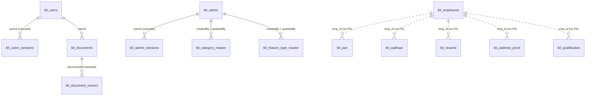

# Database Schema

**MySQL / MariaDB** via `mysql+pymysql`. 16 model files defining 15 tables (one is fully commented out).
Tables are created by `Base.metadata.create_all()` at startup.

> **Source of truth.** Derived from the model definitions. The live schema was **not inspected** — no
> dump, no migration history. Because `create_all()` never alters existing tables, a long-lived
> database may have drifted. **The live schema is not verified from the current implementation.**

## Connection

```python
# with password
SQLALCHEMY_DATABASE_URL = f"mysql+pymysql://{DB_USERNAME}:{DB_PASSWORD}@{DB_HOST}:{DB_PORT}/{DB_NAME}"
# without password (conditional branch)
SQLALCHEMY_DATABASE_URL = f"mysql+pymysql://{DB_USERNAME}@{DB_HOST}:{DB_PORT}/{DB_NAME}"
```

`create_engine(..., pool_pre_ping=True)`. Slow-query logging is configured via SQLAlchemy events.

## Entity relationships



The five KYC document tables link to `tbl_employees` by **`emp_id` string with no foreign key** —
indexed, but without referential integrity.

## Audit columns

Most tables carry `createdBy`, `createdAt`, `updatedBy`, `updatedAt`, `deletedBy`, `deletedAt`. Two
conventions coexist: the KYC tables use `default=datetime.utcnow` / `onupdate=datetime.utcnow`, while
users, admin, documents and sessions use `server_default=func.now()`.

`createdBy`/`updatedBy` default to `0` and are not populated with a real user — there is no session-derived
actor on the KYC path.

---

## KYC core

### `tbl_employees`

| Column | Type | Notes |
| ------ | ---- | ----- |
| `id` | Integer PK, indexed | |
| `emp_id` | String(225), **unique**, indexed | Business key used by all document tables |
| `emp_name` | String(255), **NOT NULL** | |
| `status` | Integer, default 1 | `1` active, `-1` deleted |

`emp_role`, `document_status` (RED/GREEN) and `document_type` are **commented out** in the model —
evidence of an abandoned per-employee status feature.

### The five document tables

All share: `id` PK · `emp_id` (indexed, NOT NULL) · `full_name` · `file_path` String(1024) ·
`status` · six audit columns. Each also has a commented-out `document_id` column.

| Table | Type-specific columns |
| ----- | --------------------- |
| `tbl_pan` | `pan_number` String(255) · `date_of_birth` Date · `father_name` String(255) |
| `tbl_aadhaar` | `aadhaar_number` String(225) · `date_of_birth_or_yob` Date · `gender` String(255) · `address` String(500) |
| `tbl_resume` | `email` · `mobile_number` String(15) · `total_experience_years` Integer · `last_company` String(255) · `skills` String(225) |
| `tbl_address_proof` | `full_name` **NOT NULL** · `address` String(225) **NOT NULL** · `document_name` · `issue_date` Date |
| `tbl_qualification` | `highest_qualification` String(225) · `institute_name` · `specialization` · `year_of_passing` String(255) |

> `tbl_resume.skills` is `String(225)` — a comma-joined skills list truncates quickly.
> `tbl_address_proof.address` is `String(225)` and **NOT NULL**, so a document whose address fails to
> extract cannot be saved.

---

## Document / RAG tables

### `tbl_documents`

| Column | Type | Notes |
| ------ | ---- | ----- |
| `userId` | String(255) **FK → `tbl_users.userId`** | |
| `document_type` | String(64) | classification result |
| `filename` | String(512), NOT NULL | original name |
| `file_path` | String(1024), NOT NULL | on-disk path |
| `extracted_name`, `doc_number`, `dob` (Date), `gender`, `address` (Text) | | |
| `extra_json`, `meta_json` | Text | |

Relationships: `user` → `Users`; `document_vectors` → `DocumentVectors` with
`cascade="all, delete-orphan"`.

### `tbl_document_vectors`

`documentId` FK → `tbl_documents.id` · `chunk_index` Integer · `vector` Text ("store JSON string or use
BLOB") · audit columns.

> These two tables belong to the `documents/*` flow, which has **no registered router**. The live KYC
> path writes to the five typed tables and ChromaDB instead. Whether any live path populates these is
> **not verified from the current implementation.**

---

## Users, admin and sessions

### `tbl_users`

`userId` String(100) **unique**, defaulted by `generate_userId` · `fullname` · `username` ·
`password` String(255) · `mobile` String(10) **unique, indexed** · `dialingCode` default 91 ·
`email` **NOT NULL** · `status` · `companyName` · `country` · `state` · `city` · `pincode` ·
`address` · `latitude`/`longitude` (String) · `gst` · `pan` · audit columns.

Relationships: `sessions` (cascade delete-orphan), `documents`.

### `tbl_admin`

`userId` unique · `admin_name` · `mobile` unique indexed · `password` · `email` NOT NULL · `role` ·
`status` · `sessions` relationship.

### Session tables

| Table | Key columns |
| ----- | ----------- |
| `tbl_users_sessions` | `userId` FK → `tbl_users.userId` · `session_token` NOT NULL · `deviceId` · `sessionType` default `WEB` · `status` |
| `tbl_admin_sessions` | same shape, FK → `tbl_admin.userId` |
| `tbl_emp_session` | `employee_id` indexed · `session_token` **unique, indexed** · `status` · `createdAt` — minimal, no audit columns |

`app/models/session_model.py` is **entirely commented out**.

### `tbl_otps`

`dialingCode` · `mobile` String(15) · `email` · `platform` · `otpType` · `otp` Integer NOT NULL
default 0 · `failOtpAttempt` Integer NOT NULL default 0 · `status`.

---

## Masters

| Table | Columns |
| ----- | ------- |
| `tbl_category_master` | `name` String(255) **NOT NULL** · `description` String(500) · `imageId` · `imagePath` · `status` · `createdBy`/`updatedBy` FK → `tbl_admin.id` with `created_by_user`/`updated_by_user` relationships |
| `tbl_feature_type_master` | `name` String(150) **NOT NULL** · `description` Text · `status` · `imageId` String(50) · `imagePath` · `createdAt`/`updatedAt` as `DateTime(timezone=True)` with a `utc_now` default |

`tbl_feature_type_master` is the only table using timezone-aware columns.

---

## Indexes and constraints

**Indexes:** primary keys, plus unique indexes on `tbl_employees.emp_id`, `tbl_users.userId`,
`tbl_users.mobile`, `tbl_admin.userId`, `tbl_admin.mobile`, `tbl_emp_session.session_token`, and
non-unique indexes on `emp_id` in all five document tables and `employee_id` in `tbl_emp_session`.

**No secondary indexes** on columns queried constantly — `status` on every table,
`tbl_document_vectors.documentId`, `tbl_documents.userId`.

**Constraints:** foreign keys as listed. No check constraints. No unique constraint on
`tbl_users.username` (explicitly `unique=False`) or on master names.

---

## Known problems

| # | Problem | Impact |
| - | ------- | ------ |
| 24 | **No migrations** | Model changes never reach an existing database |
| — | `tbl_resume.skills` is `String(225)` | Skill lists truncate |
| — | `tbl_address_proof.address` is `String(225)` **NOT NULL** | Extraction failure blocks the insert |
| — | Document tables link by `emp_id` string with **no FK** | Orphaned documents possible after employee deletion |
| 16 | `session_model.py` fully commented out | Dead file |
| — | Two audit-timestamp conventions across tables | Inconsistent `createdAt` semantics |

See [../../AUDIT.md](../../AUDIT.md).
