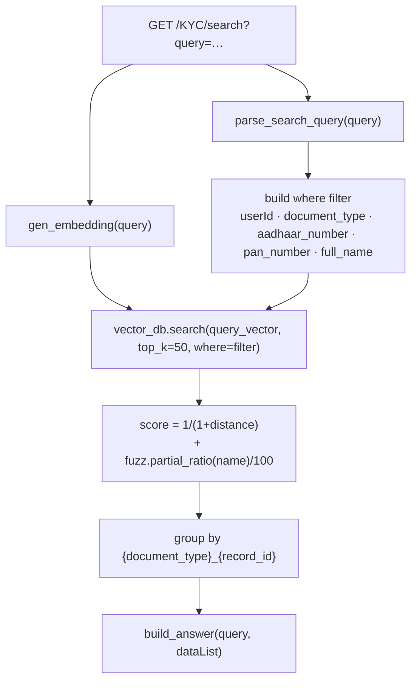

# Module — Document RAG

Retrieval over extracted KYC documents: a natural-language query is parsed for structured hints,
embedded, matched against ChromaDB with metadata pre-filtering, then re-ranked with fuzzy name
matching.

**Status:** ✅ Live — serves `GET /KYC/search`.

**Implementation:** [`app/services/kyc_document_service.py`](../../backend/app/services/kyc_document_service.py)
(`handle_search_documents`), [`app/vector/vector_db.py`](../../backend/app/vector/vector_db.py) (367 lines),
[`app/utils/kyc_document_parser.py`](../../backend/app/utils/kyc_document_parser.py)
(`gen_embedding`, `parse_search_query`, `build_answer`).

> This is a **retrieval** pipeline, not a generative one. It returns matched records; it does not send
> retrieved context back to an LLM to compose an answer. The generative variant lives in the
> unregistered [Policy module](policy.md).

## Configuration

| Component | Value | Source |
| --------- | ----- | ------ |
| Vector store | **ChromaDB**, `chromadb.PersistentClient(path="./vector_db")` | `vector/vector_db.py:15` |
| Embedding model | **`models/text-embedding-004`** | `kyc_document_parser.py:37` |
| Retrieval depth | `top_k=50` | `handle_search_documents` |
| Re-ranking | RapidFuzz `partial_ratio` on name | same |
| Chunking | `chunk_text(text, size=50_000)`, **no overlap** | `kyc_document_service.py:36` |

Embedded mode means Chroma runs **in-process** against a local directory — there is no server to start.

## Indexing

Runs as the final stage of KYC upload:

```python
chunks = chunk_text(text)                 # size=50_000 → usually one chunk
for chunk in chunks:
    vector_db.add_vector(
        vector=gen_embedding(chunk),
        metadata=build_vector_payload(userId, employee_id, record_id, details),
        document_details=details,
    )
```

`build_vector_payload` produces the metadata used later for filtering — `userId`, `employee_id`,
`record_id`, `document_type`, `full_name`, and document-specific keys such as `aadhaar_number` and
`pan_number`. The document payload itself is stored as the Chroma "document" string.

> **Chunking is effectively disabled.** At 50,000 characters, virtually every KYC document becomes one
> chunk, so retrieval works at whole-document granularity and long resumes embed poorly. The unused
> `kyc_chroma_service` already uses a sensible `RecursiveCharacterTextSplitter(chunk_size=800,
> chunk_overlap=150)` — that is the pattern to adopt. [AUDIT.md](../../AUDIT.md) issue 18.

## Query pipeline



### Query parsing

`parse_search_query` extracts structured hints from free text using dedicated helpers:

| Helper | Extracts |
| ------ | -------- |
| `extract_name_from_query` | Candidate name |
| `detect_document_type` | `aadhaar_card`, `pan_card`, `resume`, … |
| `detect_gender` | Gender term |
| `extract_dob_from_query` | Date of birth |

Whatever is found becomes a **metadata pre-filter**, so "show me Ramesh's PAN card" narrows to
`document_type=pan_card` and `full_name=ramesh` before any vector comparison.

```python
where = {"userId": user_id.lower()}
if parsed.get("document_type"): where["document_type"] = parsed["document_type"]
if parsed.get("aadhaar_number"): where["aadhaar_number"] = parsed["aadhaar_number"]
if parsed.get("pan_number"):     where["pan_number"]     = parsed["pan_number"]
if target_name:                  where["full_name"]      = target_name.lower()
```

### Hybrid scoring

```python
score = (1 / (1 + dist)) + (
    fuzz.partial_ratio(target_name, normalize(payload.get("full_name"))) / 100
    if target_name else 0
)
```

Vector distance is converted to a similarity in `(0, 1]` and a fuzzy name score in `[0, 1]` is added.
Name agreement can therefore double a result's score — deliberately weighting exact-person matches
over general semantic similarity, which is the right trade-off for KYC lookup.

Results are grouped by `{document_type}_{record_id}` so multiple chunks of one document collapse into
a single hit, then passed to `build_answer`.

## Vector store API

[`app/vector/vector_db.py`](../../backend/app/vector/vector_db.py) wraps Chroma in a `VectorStore` class:

| Method | Purpose |
| ------ | ------- |
| `add_vector(vector, metadata, document_details)` | Upsert; logs collection count before and after |
| `search(query_vector, top_k, where)` | Filtered similarity search |
| `build_where_filter(filters)` | Translates a flat dict into Chroma's filter syntax |
| `search_with_advanced_filters(...)` | Extended variant |
| `delete_by_ids` / `delete_by_document` / `delete_by_filter` | Deletion |
| `get_by_ids(ids, include)` | Direct fetch |
| `_ensure_python_floats(vec)` | Coerces numpy floats before insertion |

A module-level singleton is created at import and prints the collection count:

```python
vector_db = VectorStore()
print("🔥 Global Vector DB Loaded — Count =", vector_db.collection.count())
```

Unlike some sibling implementations, this uses `get_or_create_collection` — the collection is **not**
destroyed on restart. Indexed documents survive a reboot.

## Database interaction

Reads none directly at query time — everything needed is in the Chroma payload. A parallel record of
vectors exists in `tbl_document_vectors` (`documentId`, `chunk_index`, `vector` as text), related to
`tbl_documents` with `cascade="all, delete-orphan"`.

> `tbl_documents` and `tbl_document_vectors` belong to the `documents/*` flow, which has no registered
> router. The live KYC path writes to the five typed tables and Chroma instead. Whether these two
> tables are populated by any live path is **not verified from the current implementation**.

## API

`GET /KYC/search?query=<text>` — see [../api/kyc.md](../api/kyc.md).

Validation: empty or whitespace-only queries return `Code 4002`.

## Authentication

`PK-apiToken` only. `request.state.userId` is overwritten with the hard-coded constant at
[`kyc_routes.py:65`](../../backend/app/routes/kyc_routes.py) **before** the filter is built, so the
tenant filter is effectively a constant.

## Known limitations

1. **Chunking at 50,000 characters with no overlap** — retrieval is whole-document.
2. **The tenant filter is a constant** because of the hard-coded `userId`.
3. **`top_k=50` with no score threshold** — fifty candidates are always fetched and re-ranked; weak
   matches still surface.
4. **No generation step.** Retrieved records are returned as structured data, not synthesised into an
   answer.
5. **Two other vector stores exist** using a *different* embedding model (`models/embedding-001`);
   vectors are not comparable across them. [AUDIT.md](../../AUDIT.md) issues 12 and 14.
6. **No re-index command** — there is no endpoint or script to rebuild the collection from MySQL.
7. **Deletion is not wired** — `handle_delete_document` and the `VectorStore` delete methods exist but
   no route calls them, so removing an employee leaves their vectors searchable.
8. **The embedding model loads at import**, adding startup time to every reload.
