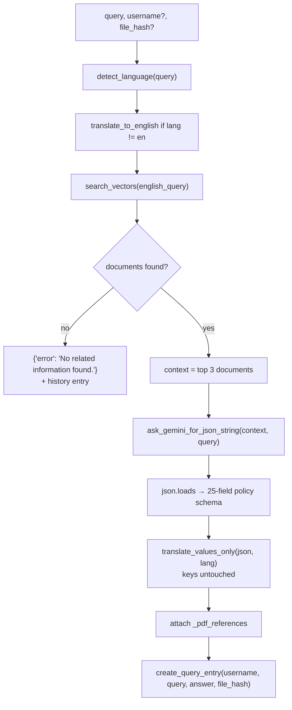

# Module — Policy

Insurance-policy document extraction and multilingual Q&A. A complete RAG pipeline exists in the
codebase — with generation, which the KYC module lacks — but **none of it is reachable**.

**Status:** ❌ Not wired in. Three routers are commented out of `main.py`; the service that implements
the pipeline is imported by nothing and contains four defects.

## Why it is documented

Its UI is fully built (three pages behind the **Policies** sidebar menu), its backend code is
substantial, and it is the only place in the repository where retrieved context is sent back to an LLM
to compose an answer. Anyone re-enabling it needs to know exactly what they are switching on.

## What exists

| Layer | File | Lines | Registered |
| ----- | ---- | ----: | :--------: |
| Route — upload/download/view | [`app/routes/upload.py`](../../backend/app/routes/upload.py) | 71 | ❌ |
| Route — policies/query/health | [`app/routes/query.py`](../../backend/app/routes/query.py) | 319 | ❌ |
| Route — library/pdf | [`app/routes/library.py`](../../backend/app/routes/library.py) | 55 | ❌ |
| Service — the RAG pipeline | [`app/services/rag_service.py`](../../backend/app/services/rag_service.py) | 258 | — imported by nothing |
| Vector store | [`app/services/vector_db.py`](../../backend/app/services/vector_db.py) | 95 | — used only by `rag_service` |
| Support | `gemini_service.py` (172), `translator_service.py` (60), `pdf_reader.py` (76), `user_db.py` (599) | | |

Disabled at [`app/main.py:9-11, 29-30`](../../backend/app/main.py):

```python
# from app.routes.upload import router as upload_router
# from app.routes.query import router as query_router
# from app.routes.library import router as library_router
...
# app.include_router(query_router)
# app.include_router(upload_router)
```

Note `library_router` is never even added to the (commented) include list.

## Frontend — fully built

| Sidebar → page | Handler | Backend target |
| -------------- | ------- | -------------- |
| Policies → Upload File (`/upload-file`) | `/api/upload` | `upload` |
| Policies → History (`/policy-list`) | `/api/policy-list`, `/api/policyDetail/[hash]` | `policies`, `query?file_hash=` |
| Policies → Search (`/search`) | `/api/search` | `query?q=` |
| (download) | `/api/downloadPdf/[fileHash]` | `download?file_hash=` |

All five 404 today.

## The intended pipeline — `rag_service.answer_question`



Genuinely thoughtful design: language detection, translation in and out, values-only translation so
JSON keys stay stable, PDF source attribution, and query history.

### The output schema

Gemini is asked to fill a fixed **25-field insurance-policy template** — `policy_name`, `policy_type`,
`policy_number`, `insured_name`, `nominee`, `premium_amount`, `premium_payment_frequency`,
`policy_term`, `sum_assured`, `coverage_details`, `exclusions`, `claim_process`, `renewal_terms`,
`cancellation_rules`, `maturity_benefits`, `surrender_value`, `grace_period`, `waiting_period`,
`issue_date`, `expiry_date`, `agent_name`, `agent_code`, `company_name`, `contact_details`,
`legal_disclaimer` — plus a nested `additional_info` object.

This is an **insurance** schema, not a KYC one, which suggests the module predates the KYC pivot.

## ⚠️ Four defects in `rag_service.py`

| # | Defect | Location |
| - | ------ | -------- |
| 1 | **Five broken imports** — `from services.X` instead of `from app.services.X`. Would raise `ModuleNotFoundError` at call time | 16, 17, 162, 192, 237 |
| 2 | **Infinite recursion** — `get_relevant_pdf_for_query` calls itself inside its own loop | 12-37 |
| 3 | **A 60-line `json_prompt` is built then never used** — the code calls `ask_gemini_for_json_string(context, english_query)` instead, so the carefully specified schema never reaches the model through this path | 66-131 vs 134 |
| 4 | **Unreachable return** — `return stored_json` sits inside the loop and is only reached when the inner guard succeeds; otherwise `stored_json` is undefined | 35 |

`answer_question_simple` at the bottom of the file is a partial duplicate whose body is elided with
`# ... (same as above until step 7) ...` — it would not run correctly either.

## `query.py` does not perform RAG

Despite the name, the registered-but-disabled `query.py` never touches the vector store or an LLM. It
reads JSON and PDF files from `./uploaded_pdfs` and returns them:

| Endpoint | Behaviour |
| -------- | --------- |
| `GET /policies` | Globs `uploaded_pdfs/*.json`, falls back to `*.pdf`, returns metadata sorted by mtime |
| `GET /query` | With `file_hash` → returns that stored JSON; without → returns the most recent |
| `GET /health` | Health check |

So two parallel "query" implementations exist: a real RAG pipeline nothing calls, and a filesystem
reader that would be exposed if the router were enabled.

## Vector store

`app/services/vector_db.py` — LangChain `Chroma`, collection **`pdf_chunks`**, persisted to
`./chroma_store`, embeddings from **`models/embedding-001`**.

> This is a **different embedding model** from the live KYC path (`models/text-embedding-004`).
> Vectors from the two are not comparable. [AUDIT.md](../../AUDIT.md) issue 14.

## Storage

`backend/app/uploaded_pdfs/` holds the policy PDFs and their extracted JSON; `backend/app/chroma_store/`
holds the Chroma collection. Both directories exist in the repository.

## Authentication

Not applicable — no route is registered. Had they been, `upload.py`, `query.py` and `library.py` declare
plain `APIRouter()` with **no `SwaggerAPIHeaders` dependency**, unlike every registered router, so
they would still pass through `UserApiVerifyMiddleware` but would not advertise the header in Swagger.

## Re-enabling this module

In order:

1. **Fix the five broken imports** in `rag_service.py` — prefix `app.`.
2. **Fix the recursion** in `get_relevant_pdf_for_query`.
3. **Decide the prompt path** — either pass `json_prompt` to Gemini or delete it and document
   `ask_gemini_for_json_string` as the contract.
4. **Reconcile the embedding models** — `pdf_chunks` was built with `embedding-001`; re-index if you
   standardise on `text-embedding-004`.
5. **Uncomment the imports and includes** in `main.py`, including `library_router`, which was omitted.
6. **Decide between the two query implementations** — `rag_service.answer_question` (real RAG) or
   `query.py` (file reader). Exposing both would be confusing.
7. Add `SwaggerAPIHeaders` dependencies to match house convention.

## Known limitations

Everything above. In its current state the module is **non-functional and would not run if enabled
without repair.** Treat this document as a specification of intent plus a repair list, not as a
description of working behaviour.
