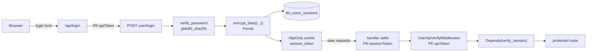

# Authentication and Authorization

Unlike many prototypes, this project has a **genuinely implemented** auth stack: real password hashing,
real session issuance, real session validation, and a working Google OAuth flow. The weaknesses are in
enforcement and cleanup, not in the cryptography.

## Two layers



**Layer 1 — application token.** `UserApiVerifyMiddleware` compares `PK-apiToken` against
`env('API_TOKEN')`. Missing → `Code 5001`; wrong → `Code 5002`. Allow-list:
`/`, `/docs`, `/redoc`, `/openapi.json`.

**Layer 2 — user session.** `verify_session` is a FastAPI dependency on `protected_router` and
`masterprotected_router`, backed by `session_service.get_user_session` and `is_device_blocked`.

## What is done well

| Control | Implementation |
| ------- | -------------- |
| Password storage | `passlib` `CryptContext(schemes=["pbkdf2_sha256"], deprecated="auto")` — `hash_password` / `verify_password` |
| Session token | `encrypt_data({...})` — Fernet, key derived by SHA-256 from `TOKEN_SECRET` |
| Cookie flags | `httpOnly: true, secure: true, sameSite: "lax", path: "/", maxAge: 7 days` — unreachable from client JS |
| Token transport | Server-side only; the browser never sees `API_TOKEN` |
| Input validation | Nine validators in `auth_service.py`: username, mobile, password, email, company, country, state, city, pincode |
| OAuth | Full authorization-code flow terminating at the real `user/login-email` endpoint |
| SQL | SQLAlchemy ORM throughout the live paths — no string-interpolated SQL |

## Endpoints

| Method | Path | Auth | Purpose |
| ------ | ---- | ---- | ------- |
| POST | `/user/signup` | token | Register |
| POST | `/user/login` | token | Mobile + password → session token |
| POST | `/user/login-email` | token | Email login — used by the OAuth callback |
| POST | `/user/generate-otp` | token | Issue OTP |
| POST | `/user/validate-otp` | token | Verify OTP |
| PUT | `/user/update-password` | token | Change password |
| POST | `/user/logout` | token + session | Invalidate session |
| POST | `/user/list_users` | token + session | List |
| POST | `/user/updateUser` | token + session | Update profile |
| GET | `/user/getUser` | token + session | Current user |
| POST | `/admin_user/signup`, `/admin_user/login` | token | Admin auth |

## Google OAuth

```
GET /api/google
  → redirect to accounts.google.com/o/oauth2/v2/auth
    client_id, redirect_uri, response_type=code, scope="openid email profile", prompt=select_account

GET /api/google/callback?code=…
  → POST oauth2.googleapis.com/token          exchange code → access_token
  → GET  googleapis.com/oauth2/v2/userinfo    fetch profile
  → POST {API_URL}user/login-email            backend issues a session token
  → set session_token cookie
```

Environment variables read directly: `CLIENT_ID`, `CLIENT_SECRET`, `REDIRECT_URI`.

> Note the naming mismatch: `app/utils/api.ts` exports `GOOGLE_CLIENT_ID`, `GOOGLE_CLIENT_SECRET` and
> `GOOGLE_REDIRECT_URI`, but `google/route.ts` reads `CLIENT_ID` and `REDIRECT_URI`. The exported
> constants are unused.

## 🔴 Confirmed weaknesses

### 1. `userId` is hard-coded on both KYC endpoints — High

```python
userId = "U-98WZ41BUTTOM"           # kyc_routes.py:59
request.state.userId = "U-98WZ41BUTTOM"   # line 65 — overwrites the middleware value
```

All documents are written under one tenant and the search filter `where={"userId": …}` is effectively
a constant. Multi-tenancy is defeated at both write and read.

### 2. Uploaded identity documents are served without authentication — High

`app.mount("/storage", StaticFiles(directory="storage"))`. PAN cards, Aadhaar cards, resumes and
address proofs are downloadable by anyone who can reach the backend. Paths are guessable because the
`userId` segment is a fixed constant.

### 3. Logout never invalidates the server-side session — High

`frontend/app/api/logout/route.ts` builds an axios config then **never executes it**. It deletes
cookies and returns success. The `tbl_users_sessions` row stays `status=1` — a captured token remains
valid indefinitely. The target path is also wrong (`logout`, not `user/logout`).

### 4. No frontend route guard — Medium

No `middleware.ts`; a single layout. `(auth)` is a Next.js route group, which affects URLs only. Pages
render for unauthenticated visitors; only the API handlers check the cookie, so pages load and then
fail to populate.

### 5. Password change and both OTP flows are unreachable — Medium

`/api/change-password`, `/api/generate-otp` and `/api/validate-otp` omit the `user/` prefix and 404.
See [../api/frontend-contract-map.md](../api/frontend-contract-map.md).

### 6. Dead crypto path — Low

`login/route.ts` computes `const encryptedToken = encrypt(token)` using `utils/crypto.ts`, then stores
the **raw** token in the cookie. The encrypted value is discarded.

### 7. Logout clears the wrong cookie — Low

Login sets `username`; logout deletes `user_email`. The `username` cookie persists after logout.

### 8. All errors return HTTP 200 — Medium

Clients must inspect `Code`. Several frontend handlers only check `res.ok`, so auth failures surface as
empty screens rather than redirects.

## Roles and permissions

`PK-role` is accepted by `SwaggerAPIHeaders` and forwarded by several frontend handlers as `"User"`,
but **is never read for any decision**. `tbl_admin.role` exists and is never consulted for
authorization. There is no role or permission enforcement anywhere.

## Deployment guidance

1. Do not expose port 8000 publicly — only the Next.js port needs to be reachable.
2. **Block or authenticate `/storage` at the proxy** until issue 2 is fixed.
3. Fix the logout call so sessions are actually invalidated.
4. Add `middleware.ts` covering the `(auth)` routes.
5. Replace the hard-coded `userId` with `request.state.userId`.
6. Treat `API_TOKEN` and `TOKEN_SECRET` as high-value secrets; rotate by editing both `.env` files and
   restarting.
7. `logs/` and `storage/` deserve the same protection as production credentials.
